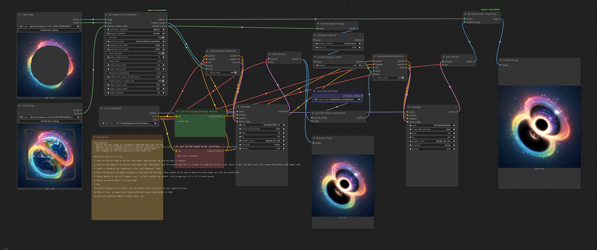

# ComfyUI-Inpaint-CropAndStitch-Linearized

**Enhanced version with linearized rescaling for professional color accuracy**

Copyright (c) 2025, Pablo Apiolazza

## Overview

This is an enhanced variant of the original ComfyUI-Inpaint-CropAndStitch nodes by Luis Quesada Torres, with the main improvement being **linearized rescaling** for professional color accuracy.

### Key Difference: Linearized Rescaling

The main enhancement is the implementation of **sRGB ↔ linear color space conversion** during image resizing operations. This ensures:

- **Professional Color Accuracy**: Images are converted to linear space before resizing, then back to sRGB
- **Histogram Preservation**: Input and output histograms match perfectly (1.0000 correlation in no-op tests)
- **Industry Standard**: Matches professional image processing workflows
- **Zero Workflow Changes**: All improvements happen automatically under the hood

### Original Functionality

The '✂️ Inpaint Crop' and '✂️ Inpaint Stitch' nodes enable inpainting only on masked areas:

- **✂️ Inpaint Crop**: Crops the image around the masked area with context, handles pre-resizing, mask processing, and target resolution
- **✂️ Inpaint Stitch**: Stitches the inpainted image back into the original image without altering unmasked areas

**Main advantages:**
- Much faster than sampling the whole image
- Enables proper context setting for accurate prompt representation
- Supports upscaling/downscaling before sampling
- Forces specific resolutions (e.g., 1024x1024 for SDXL)
- Preserves unmasked areas completely
- Automatic blending

# Video Tutorial

[](https://www.youtube.com/watch?v=mI0UWm7BNtQ)

[(click to open in YouTube)](https://www.youtube.com/watch?v=mI0UWm7BNtQ)

Note: this video tutorial is for the previous version of the nodes, but still it shows how to use them. The parameters are mostly the same.

## Parameters
- `downscale_algorithm` and `upscale_algorithm`: Which algorithms to use when resizing an image up or down.
- `preresize`: Shows options to resize the input image before any cropping: to ensure minimum resolution, to ensure maximum resolution, to ensure both minimum and maximum resolution. This makes it very convenient to ensure that any input images have a certain resolution.
- `mask_fill_holes`: Whether to fully fill any holes (small or large) in the mask, that is, mark fully enclosed areas as part of the mask.
- `mask_expand_pixels`: Grows the mask by the specified amount of pixels.
- `mask_invert`: Whether to fully invert the mask, that is, only keep what was masked, instead of removing what was marked.
- `mask_blend_pixels`: Grows the stitch mask and blurs it by the specified amount of pixels, so that the stitch is slowly blended and there are no seams.
- `mask_hipass_filter`: Ignores mask values lower than the one specified here. This is to avoid sections in the mask that are almost 0 (black) to count as masked area. Sometimes that leads to confusion, as the user believes the area is not really masked and the node is considering it as masked.
- `extend_for_outpainting`: Shows options to extend the mask in any/all directions (up/down/left/right) by a certain factor. >1 extends the image, e.g. 2 extends the image in a direction by the same amount of space the image takes. <1 crops the image, e.g. 0.75 removes 25% of the image on that direction.
- `context_from_mask_extend_factor`: Extends the context area by a factor of the size of the mask. The higher this value is, the more area will be cropped around the mask for the model to have more context. 1 means do not grow. 2 means grow the same size of the mask across every direction.
- `output_resize_to_target_size`: Forces that the cropped image has a specific resolution. This may involve resizing and extending out of the original image, but the stitch node reverts those changes to integrate the image seamlessly.
- `output_padding`: Ensures that the cropped image width and height are a multiple of this padding value. Models require images to be padded to a certain value (8, 16, 32) to function properly.

## Example (Stable Diffusion)
This example inpaints by sampling on a small section of the larger image, upscaling to fit 512x512, then stitching and blending back in the original image.

Download the following example workflow from [here](example_workflows/inpaint_sd15.json) or drag and drop the screenshot into ComfyUI.


## Example (Flux)
This example uses Flux. Requires the GGUF nodes.

Models used:

- `Flux Dev Q5 GGUF` from [here](https://civitai.com/models/711483/flux-dev-q5km-gguf-quantization-a-nice-balance-of-speed-and-quality-in-under-9-gigabytes?modelVersionId=795785). Put it in models/unet/.
- `Flux 1. dev controlnet inpainting beta` from [here](https://huggingface.co/alimama-creative/FLUX.1-dev-Controlnet-Inpainting-Beta). Put it in models/controlnet/.
- `t5 GGUF Q3_K_L` from [here](https://huggingface.co/city96/t5-v1_1-xxl-encoder-gguf/tree/main). Put it in models/clip/.
- `clip_l` from [here](https://huggingface.co/comfyanonymous/flux_text_encoders/blob/main/clip_l.safetensors). Put it in models/clip/.
- `ae VAE` from [here](https://huggingface.co/black-forest-labs/FLUX.1-schnell/blob/main/ae.safetensors). Put it in models/vae/.

Download the following example workflow from [here](example_workflows/inpaint_flux.json) or drag and drop the screenshot into ComfyUI.


## Example (Large resolution)
This example uses SD 1.5 to sample on a section of the larger image. Then it upscales the sampled image by 4x using an external model and applies a hiRes fix. Then it blends it back into the original image.

Models used:

- `4x Ultrasharp` from [here](https://huggingface.co/lokCX/4x-Ultrasharp/blob/main/4x-UltraSharp.pth).

Download the following example workflow from [here](example_workflows/inpaint_hires.json) or drag and drop the screenshot into ComfyUI.



# Installation Instructions

Install via ComfyUI-Manager or go to the custom_nodes/ directory and run ```$ git clone https://github.com/lquesada/ComfyUI-Inpaint-CropAndStitch.git```

## Best Practices
Use an inpainting model e.g. lazymixRealAmateur_v40Inpainting.

Use "InpaintModelConditioning" instead of "VAE Encode (for Inpainting)" to be able to set denoise values lower than 1.

Enable "resize to target size" and set it to a preferred resolution for your model, e.g. 512x512 for SD 1.5, 1024x1024 for SDXL or Flux.

# Installation

Install via ComfyUI-Manager or clone to your custom_nodes directory:

```bash
git clone https://github.com/APZmedia/ComfyUI-Inpaint-CropAndStitch-Linearized.git
```

## Best Practices

- Use an inpainting model (e.g., lazymixRealAmateur_v40Inpainting)
- Use "InpaintModelConditioning" instead of "VAE Encode (for Inpainting)" for denoise values lower than 1
- Enable "resize to target size" and set it to your model's preferred resolution (512x512 for SD 1.5, 1024x1024 for SDXL or Flux)

# Acknowledgements

**Original Work**: This enhanced version is based on the excellent work by Luis Quesada Torres (https://github.com/lquesada) who created the original ComfyUI-Inpaint-CropAndStitch nodes. The linearized rescaling improvements build upon his solid foundation.

**Additional Credits**: This repository uses some code from comfy_extras (https://github.com/comfyanonymous/ComfyUI), KJNodes (https://github.com/kijai/ComfyUI-KJNodes), and Efficiency Nodes (https://github.com/LucianoCirino/efficiency-nodes-comfyui), all of them licensed under GNU GENERAL PUBLIC LICENSE Version 3.

**Linearization Research**: The sRGB ↔ linear color space conversion implementation is based on industry-standard practices for professional image processing and color accuracy. 

# License
GNU GENERAL PUBLIC LICENSE Version 3, see [LICENSE](LICENSE)
